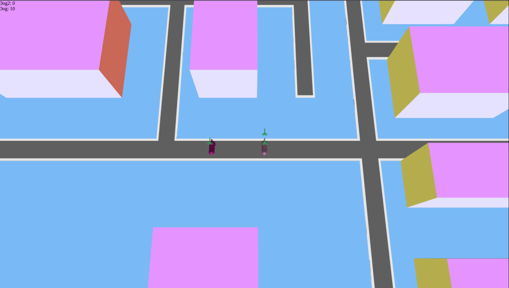

# Dog Story

## Пример интерфейса



**Dog Story** — серверная часть браузерной игры на C++, демонстрирующая современную модульную архитектуру и интеграцию веб-технологий. Проект создан для отработки навыков разработки серверной части браузерных игр и бекенда в целом.

---

## 📐 Архитектура

Система разделена на четыре уровня:

1. **Сервер**  
   - Принимает входящие HTTP-запросы  
   - Раздаёт статику (HTML/JS/CSS) из каталога `static`  
   - Перенаправляет игровые API‑запросы в HTTP‑обработчик  

2. **HTTP‑обработчик**  
   - Парсит и роутит запросы  
   - Формирует вызовы прикладного слоя (Application) для дальнейшей обработки  

3. **Прикладной слой**  
   - Оркеструет игровые сценарии  
   - Взаимодействует с моделью игрового мира  
   - Управляет состоянием и бизнес‑логикой  

4. **Модель игрового мира**  
   - Хранит данные об игроках, объектах и событиях  
   - Инкапсулирует все правила игры и логику взаимодействия  

---

## 🛠 Технологический стек

- **C++17** — основной язык разработки для максимальной производительности  
- **Boost** (Asio, Beast и сопутствующие модули) — асинхронный ввод‑вывод и HTTP  
- **CMake** — система сборки и управления зависимостями  
- **Docker** — контейнеризация и унифицированное окружение для деплоя  

---

## 🎯 Цели проекта

- Разработка производительного backend‑сервера на современном C++  
- Применение принципов модульного дизайна и разделения ответственности  
- Практика работы с Boost.Asio/Beast для реализации асинхронного HTTP‑сервера  
- Освоение инструментов CMake и Docker для сборки и деплоя  
- Создание примера полного клиент‑серверного приложения для портфолио  

---

## 🚀 Запуск

> **Инструкция по сборке и запуску (пример)**  
> *(будет детализирована позднее)*  
>
> ```bash
> git clone https://github.com/Add-JDHero/cppbackend.git
> cd cppbackend
> mkdir build && cd build
> cmake ..
> make
> docker build -t dog-story-backend .
> docker run -p 8080:8080 dog-story-backend
> ```

---

## 📚 Используемые библиотеки

- **Boost.Asio** — асинхронный ввод‑вывод  
- **Boost.Beast** — HTTP‑сервер и клиент  
- **Boost.System** — обработка ошибок и коды состояния  
- **Boost.Filesystem** — работа с файловой системой  
- **C++ Standard Library (STL)**  


